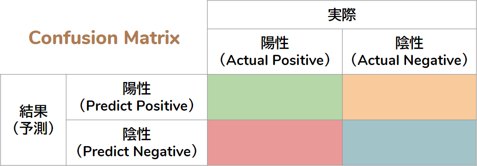
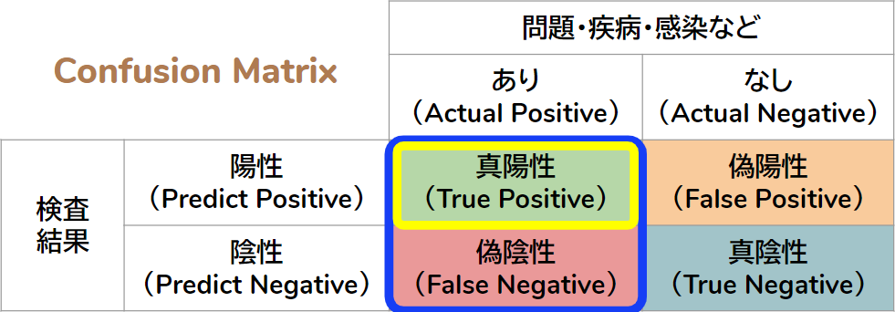

```{css, echo=FALSE}
strong {background: linear-gradient(transparent 70%, #a7d6ff 60%)}
# code {border: solid 1px #ffadad;  /*#c7254e;*/ }

h1 {border-bottom: solid 1.75px;}
h2 {border-bottom: solid 1.50px;}
h3 {font-weight: bold;}
```


```{r setup, include=FALSE}
knitr::opts_chunk$set(echo = TRUE, message = FALSE, fig.align = "center")

htmltools::tagList(rmarkdown::html_dependency_font_awesome())

require(tidyverse)
```


## 　
<font size="+5">
Confusion Matrix  
　基礎的な知識としての混同行列  
  
</font>
　  
CC BY-NC-SA 4.0, Sampo Suzuki  
　  

　| <font size="+3">途中質問</font> | <font size="+3">写真撮影</font> | <font size="+3">動画撮影</font> | <font size="+3">後日質問</font> |　
--|:---------------:|:---------------:|:---------------:|:---------------:|--
　| <font size="+5">NG</font> | <font size="+5">NG</font> | <font size="+5">NG</font> | <font size="+5">ML</font> |


## Confusion Matrix
　新型コロナウイルスの検査で話題になった**感度**や**特異度**という指標は医学的な検査や機械学習の分類で用いる Confusion Matrix（混同行列）に基づいて計算されます。  
　  
```{r, echo=FALSE, out.width="95%"}

```


## 用語の定義
　検査は完全ではありませんので検査の結果はあくまでも**疑いがある**か否かなです。つまり、誤判定がありうるということが大前提になっています。検査結果の陽性・陰性は  

* 陽性 - 問題・疾病・感染の**疑いがある**
* 陰性 - 問題・疾病・感染の疑いがある**とは言えない**

　となります。誤判断がありえますので、これらを区分するために行列の要素は以下のように表現します。

* 真陽性 - 実際に陽性で検査結果も陽性
* 偽陽性 - 実際は**陽性**だが検査結果が**陰性**
* 真陰性 - 実際に陰性で検査結果も陰性
* 偽陰性 - 実際は**陰性**だが検査結果が**陽性**


## Confusion Matrix
　つまり、真陽性・偽陽性・真陰性・偽陰性は下表のような関係となります。   
　  
```{r, echo=FALSE, out.width="95%"}
knitr::include_graphics("fig/ConfusionMatrix2.png")
```


## 感度とは？
　感度（sensitivity）とは問題・疾病・感染を見逃さない割合（見つけられる割合）で、再現率・真陽性率とも呼ばれます。  

```{r, echo=FALSE, out.width="95%"}

```

$Sensitivity = \frac{True Positive}{True Positive + False Negative}$


## 特異度とは？
　特異度 (specificity)とはであり、問題・疾病・感染がないものを疑いがあるとは言えなとする割合で、真陰性率とも呼ばれます。  

 $Specificity = \frac{Ture Negative}{False Positive + True Negative}$ 


## 新型コロナウイルスPCR検査
　新型コロナウイルスのPCR検査における感度は $30\% \sim 70\%$ と（ネット上では）言われています。仮に感度が $70\%$ としても $30\%$ を見逃す可能性があります。  
　一方、特異度は $90\%$ 程度だと言われています。

 
## [CC BY-NC-SA 4.0 <i class="fa fa-external-link"></i>](https://creativecommons.org/licenses/by-nc-sa/4.0/deed.ja){target="_blank" title="ライセンスの要約"} , Sampo Suzuki

* 表示
    * あなたは 適切なクレジットを表示し、ライセンスへのリンクを提供し、変更があったらその旨を示さなければなりません。これらは合理的であればどのような方法で行っても構いませんが、許諾者があなたやあなたの利用行為を支持していると示唆するような方法は除きます。
* 非営利
    * あなたは営利目的でこの資料を利用してはなりません。
* 継承
    * もしあなたがこの資料をリミックスしたり、改変したり、加工した場合には、あなたはあなたの貢献部分を元の作品と同じライセンスの下に頒布しなければなりません。

　  

* 本資料中で引用してるロゴなどの著作権は原著作権者にあります。


# enjoy !